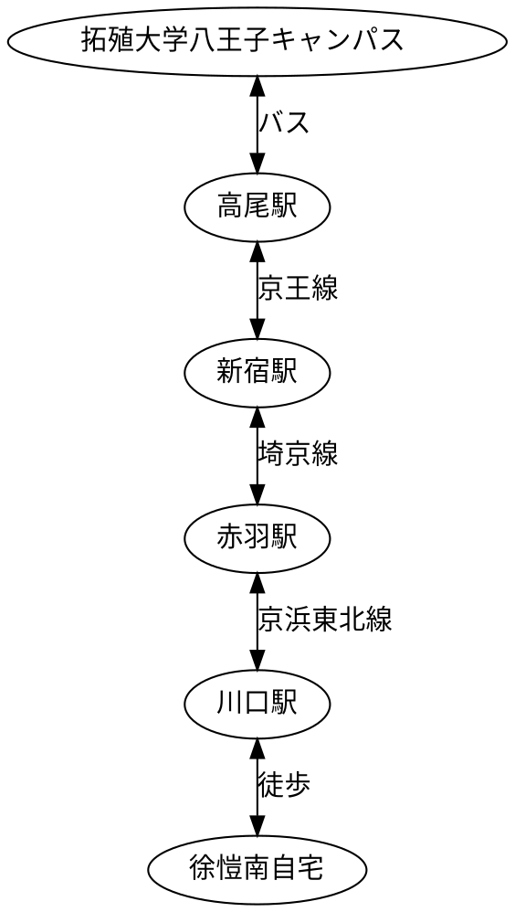

# 徐愷南の通学経路

[メンバー表に戻る](member.md#メンバー表)

```graphviz
digraph {
    edge [dir=both]
    拓殖大学八王子キャンパス　-> 高尾駅[label=バス]
    高尾駅->新宿駅[label=京王線]
    新宿駅->赤羽駅[label=埼京線]
    赤羽駅->川口駅[label=京浜東北線]
    川口駅->徐愷南自宅[label=徒歩]
}
```
